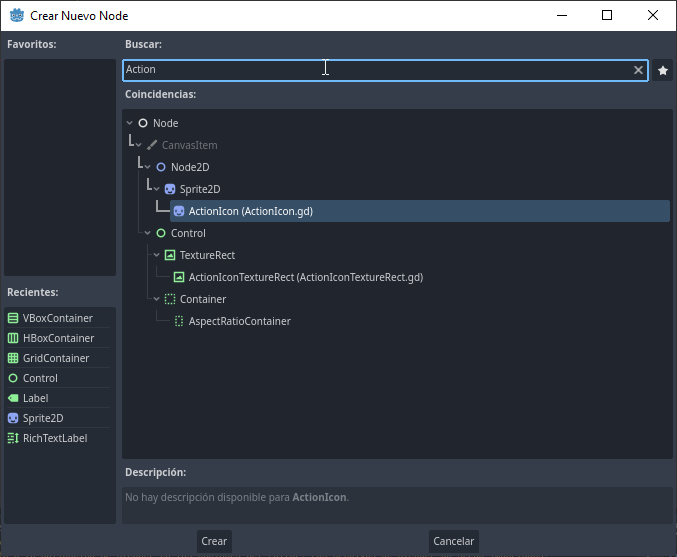
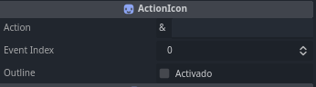

# Awesome Input Icons


 A Object class with `static functions` that search the given action name and returns the proper icon. Icons made by Kenney. *(Note: right now only supports keyboard and mouse because i don´t have that much time)*

## Contents

 This addon adds 2 Classes (`InputIcon` and `InputIconTextureRect`) to the tree and a Object class (`InputIconGlobal`)

* `InputIconGlobal`
  * Its sole purpose is to provide static functions, this way you can call `InputIconGlobal.*` similar to an autoload (without being one)
* `InputIcon` and `InputIconTextureRect`
  * They are `Sprite2D` and `TextureRect` respectively as premade classes to ease common use cases. They both are essentially the same

## How to use

With the addon activated, add a new node and select the `InputIcon` or `InputIconTextureRect`, they are inside the `Sprite2D` node and `TextureRectNode`. You can also search for them using `InputIcon`


Once you added them, you will notice that they are the same nodes you know, except for these:


You put the action name in `Action`, the event you want to show in `event_index` and since the asset pack contains outlined icon, you can choose their style as well with `Outline`
<details>
<summary>
Step-by-step guide
</summary>
I have a dummy action called `action_one`


So if i put `action_one` in `action`, `0` in `event_index` and leave `outline` as `false` like so:


It gives me:


Heres with `InputIconTextureRect` with all my events:


</details>

___
Both actions have the same script except they extends from different classes, check it out
>

```GDScript

## The name of the action, it has to exist in the InputMap
@export var action: StringName = "":
 set(value):
  action = value
  if !action:
   return
  _update()

## The index of the event, to select if theres more than one
@export var event_index: int = 0:
 set(value):
  event_index = value
  _update()

## If the icon should be outlined
@export var outline: bool = false:
 set(value):
  outline = value
  _update()


## It updates the texture, this way all 3 properties gets updated at the same time
func _update():
 texture = InputIconGlobal.get_icon(action, event_index, outline)

```

This line: `InputIconGlobal.get_icon(action, event_index, outline)` is basically all you are gonna need, with the name of the action, the event index and a option outline, it returns a `Texture2D` or `null`

Check out the [docs](https://github.com/DaviD4Chirino/Awesome-Input-Icons/wiki)
___

### Credits

* [Kenney](https://www.kenney.nl)
  * for his amazing work providing the [icons](https://www.kenney.nl/assets/input-prompts) for free and his whole collection of free game assets
