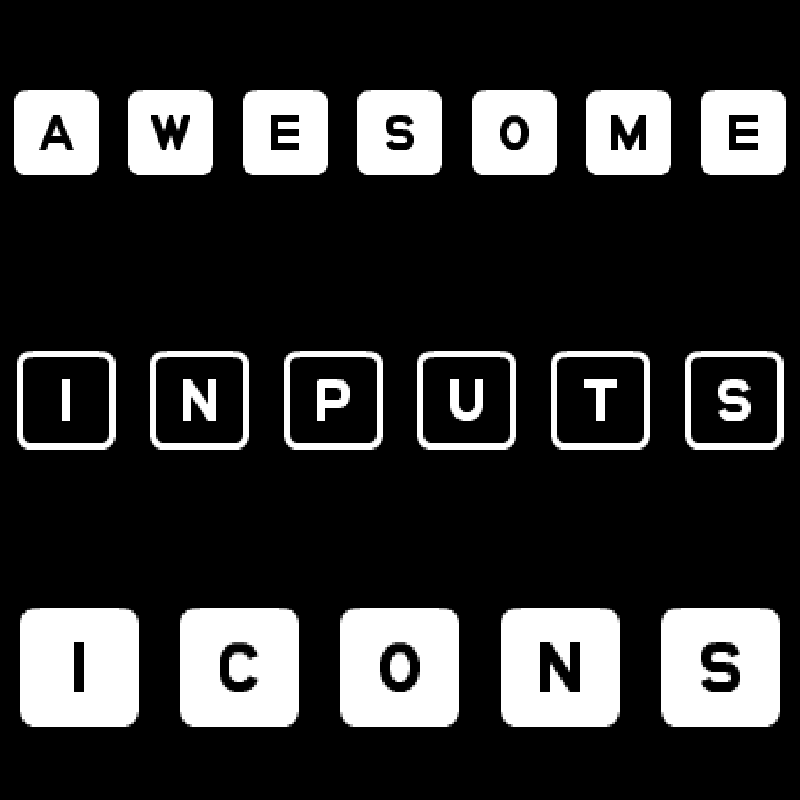
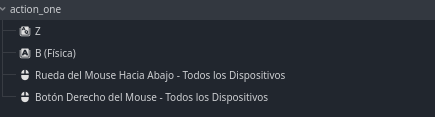
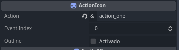
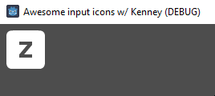
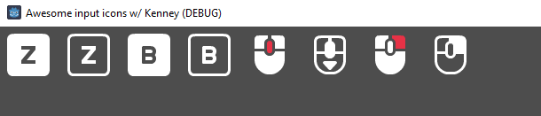

# Awesome Input Icons



 A Object class with `static functions` that search the given action name and returns the proper icon. Icons made by Kenney.

## Installation

Go to the releases tab and download the latest source. Inside it there will be a addons folder with the `awesome input icons`. Drag and drop the addons folder into the base of your project.

Or go to the `AssetLib` tab and search for `Awesome Input Icon` and download it form there.

Then go to `project>project config>plugins` and activate Awesome Input Icons.

## How to use

You can:

1. Use either the `InputIconSprite2D` or `InputIconTextureRect`, they will have exported variables of `action_name` and `event_index`. The action_name MUST be the same in your input_map, and the event can go into negatives but not be grater than the event list.
   
   * Once you fill that up it will display an icon defined in your `InputIconScheme`, in this case it will be in the default scheme in: `addons/awesome_input_icons/resources/default_input_icons_outline.tres`

2. You can use in code with this line:
   
   * ```InputIcon.get_icon(action_name: StringName, event_index: int = 0)``` as it returns a `Texure2D`

3. If you dont have a action_name you can use `get_icon_by_event(event: InputEvent)` with is the same as `get_icon` but it does not convert the action_name into a event and instead it work directly with the event

<details>
<summary>
How to use InputIconTextureRext and InputIconSprite2D, step by step
</summary>

I have a dummy action called `action_one`



So if i put `action_one` in `action`, `0` in `event_index` and leave `outline` as `false` like so:


It gives me:


Heres with `InputIconTextureRect` with all my events:



___

Both actions have the same script except they extends from different classes, check it out

> 

```GDScript
## The name of the action in your InputMap, it has to be an existing action
@export var action_name: StringName = &"":
 set(value):
  action_name = value
  _update()

## The Index of the event, if you have more than one event in the same action.
## You can use negative numbers but not a number bigger than the number of events
@export var event_index: int = 0:
 set(value):
  event_index = value
  _update()


func _ready():
 _update()


func _update():
 texture = InputIcon.get_icon(action_name, event_index)
```

</details>

## Contents

This addon has  `RefObject` of the class_name `InputIcon`. It contains static variables and functions ready to be used everywhere. Think of it as an `autoload` *(You can use it as `InputIcon.get_icon(...)`)*

It adds a handful of deferent classes to the editor, they are as follows:

* `InputIconConfiguration`
  * As the name implies, is a resource that contains configuration data for the addon and the project, right now only has the `InputIconScheme` in the `scheme` variable
* `InputIconScheme`
  * Contains 3 exported arrays and 3 static arrays as well as an exported boolean called `generate_presets`
    * `generate_presets` once activated inside the editor, will delete all the data of the arrays and populate them with all the necessary data for a fresh scheme *(Instead of adding 193 elements to the array, putting the correct index for each key of the keyboard, activate this and it will do that for you, and alo for the joystic and mouse; __WARNING:__ this destroys the previous changes)*
  * The exported arrays `keys`, `mouse_buttons` and `joy_buttons`
    * all of them are the same, separated to be easier to edit and categorize. They only accept a custom class called `KeyIcon`
* `KeyIcon`
  * It exports three variables: `keycode`, `icon` and `InputType`
    * `keycode` is a integer that represents the index of the event, to be referenced again in the InputEvents enums
    * `icon` is a `Texure2D` to go along this `keycode`, in other words if the keycode and type corresponds to the left mouse button, you will get this value if your action is the left mouse button
    * `InputType`, since the keycode value changes depending of what type of input it is, you need to specify the type.
    * After you add a type and a keycode, the Resource will rename itself to the name of the key for better readability

## Customization

If you want to create your own input icons you can create a new `InputIconScheme` and click `generate_presets`, that will give you something like this:

  

Inside it will look like:


and then you just open the key you want to add the icon, and put them in the icon parameter (do not mess with the other values) like so:


finaly you reference the new scheme in the `input_icon_configuration.tres` resource located in the base of the addon: `addons/awesome_input_icons/input_icon_configuration.tres`

___

### Credits

* [Kenney](https://www.kenney.nl)
  * for his amazing work providing the [icons](https://www.kenney.nl/assets/input-prompts) for free and his whole collection of free game assets
